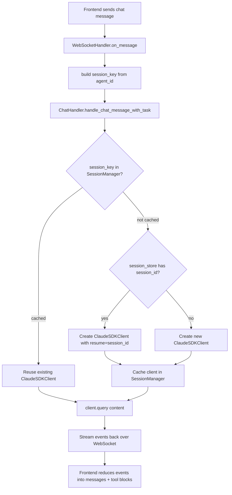
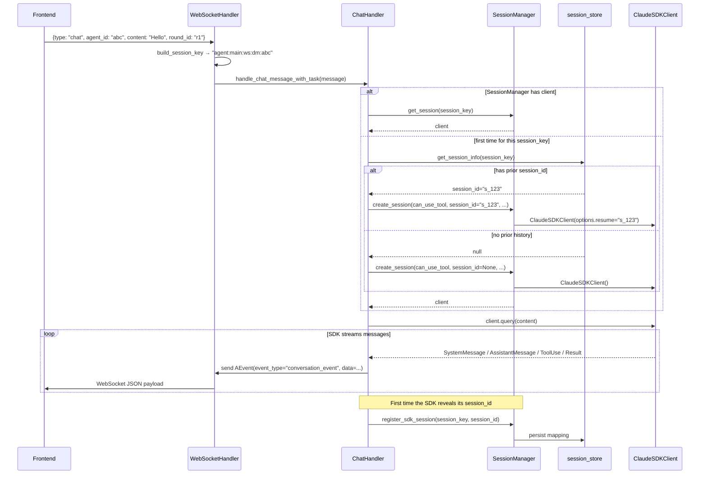
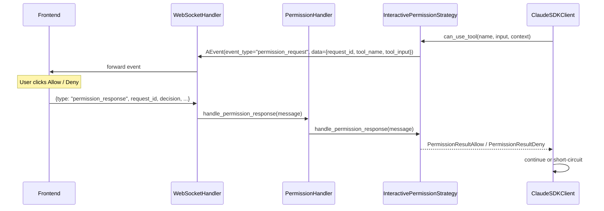
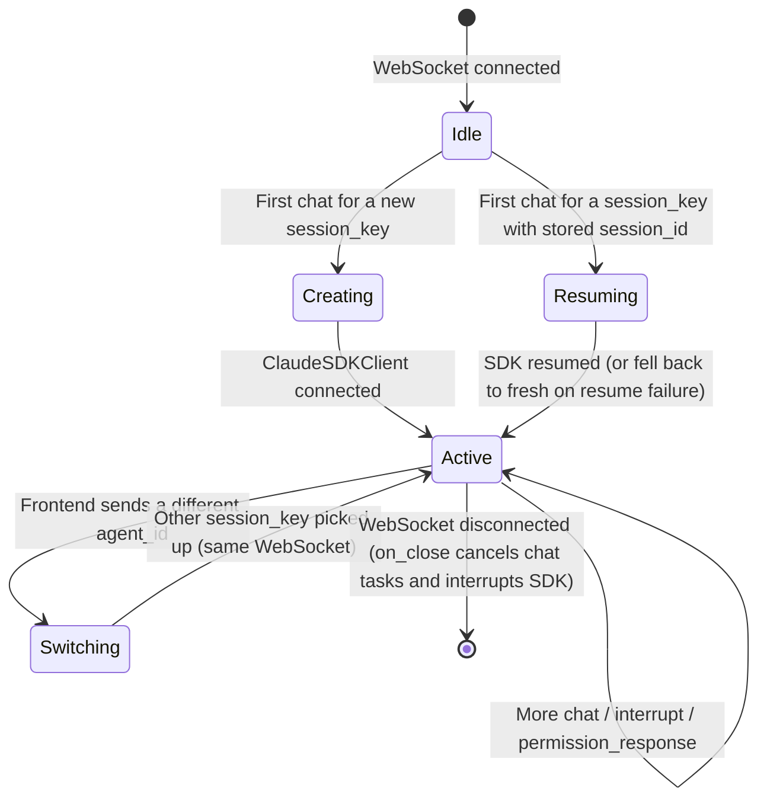

# WebSocket Session Management Flow

## Design

- **Lazy session creation.** No session is created until the user sends a `chat` message. The same WebSocket connection can route to multiple sessions, distinguished by `session_key`.
- **Deterministic routing.** Sessions are addressed by `session_key`, a structured string built from the channel + chat type + agent reference. The frontend sends `agent_id`; the WebSocket handler converts it into a `session_key` before dispatching.
- **Resume from disk.** When a `session_key` is seen for the first time in memory, the backend checks the on-disk session store and resumes the SDK session if a matching `session_id` exists. Otherwise it starts fresh.

## Session keys

Format: `agent:<agentId>:<channel>:<chatType>:<ref>[:topic:<threadId>]`

Built by `build_session_key()` in `agent/service/session/session_router.py`. For a WebSocket DM with `agent_id = "abc-123"`, the key is:

```
agent:main:ws:dm:abc-123
```

The handler in `agent/service/websocket_handler.py` converts the incoming `agent_id` field into a `session_key` automatically:

```python
if "agent_id" in message and "session_key" not in message:
    message["session_key"] = build_session_key(
        channel="ws", chat_type="dm", ref=message["agent_id"]
    )
```

`session_key` is what the rest of the backend uses for routing; `session_id` is the SDK's own identifier returned after the SDK session is created. The two are mapped in `SessionManager._key_sdk_map`.

## Overall flow



## Detailed sequence



## Tool permission flow

When the SDK is configured with `can_use_tool` and Claude calls a tool that needs approval, the backend pauses execution and emits a `permission_request` event. The frontend renders an inline approval UI; the user's response comes back as a `permission_response` message.



Multiple `permission_request` events can be in flight at once. The frontend keeps a `Map<request_id, permission>` so each prompt is independent (`web/src/hooks/agent/index.ts:pendingPermissions`).

If the frontend doesn't respond within 60 seconds, `InteractivePermissionStrategy` auto-denies with the message `"Permission request timeout"`.

## Message protocol

### Frontend → backend

```ts
// Chat message
{
  type: "chat",
  agent_id: string,        // required; converted to session_key by the handler
  session_key?: string,    // optional override
  content: string,
  round_id?: string,       // frontend-issued ID for this user turn
}

// Interrupt the current generation
{
  type: "interrupt",
  agent_id: string,
  round_id?: string,
}

// Respond to a permission_request
{
  type: "permission_response",
  request_id: string,        // echo the request_id from permission_request
  decision: "allow" | "deny",
  message?: string,          // free-text message returned to the SDK on deny
  user_answers?: any[],      // only for AskUserQuestion tool
}

// Heartbeat
{ type: "ping" }
```

Unknown `type` values are routed to the error handler.

### Backend → frontend

The backend wraps everything in an `AEvent` envelope (`agent/service/schema/model_message.py`):

```json
{
  "event_type": "conversation_event",   // or "permission_request"
  "agent_id": "abc",
  "session_id": "s_123",
  "data": { ... },
  "timestamp": "2026-05-27T21:30:00Z"
}
```

#### `conversation_event`

`data` carries either a streamed delta or a full message snapshot:

```json
{
  "event_id": "uuid",
  "seq": 4,
  "turn_id": "r1",
  "kind": "message_delta",
  "delta": { "type": "content_block_delta", ... }
}
```

```json
{
  "event_id": "uuid",
  "seq": 5,
  "turn_id": "r1",
  "kind": "message_upsert",
  "message": { "role": "assistant", "content": [...], ... }
}
```

The frontend reducer in `web/src/hooks/agent/index.ts` (`reduceIncomingMessage`) handles both kinds — deltas merge into the in-progress assistant message, upserts replace by `message_id` and merge `tool_result` blocks back onto their `tool_use` parents.

#### `permission_request`

```json
{
  "event_type": "permission_request",
  "agent_id": "abc",
  "session_id": "s_123",
  "data": {
    "request_id": "uuid",
    "tool_name": "Bash",
    "tool_input": { "command": "ls -la", "description": "List files" }
  },
  "timestamp": "..."
}
```

#### Error envelope

```json
{
  "error_type": "...",
  "message": "...",
  "agent_id": "abc",
  "timestamp": "..."
}
```

## Session lifecycle



When the WebSocket closes, `WebSocketHandler.on_close()` cancels every in-flight chat task and calls `client.interrupt()` on each cached SDK client.

## Key files

| Path | Role |
|---|---|
| `agent/service/websocket_handler.py` | Top-level WS lifecycle + message routing |
| `agent/service/session/session_router.py` | `build_session_key` / `parse_session_key` |
| `agent/service/handler/chat_handler.py` | Builds SDK options, attaches `can_use_tool`, runs `client.query` |
| `agent/service/handler/permission_handler.py` | Routes `permission_response` to the active strategy |
| `agent/service/channel/websocket_channel.py` | `WebSocketSender` + `InteractivePermissionStrategy` |
| `agent/service/session_manager.py` | In-memory cache of `ClaudeSDKClient` keyed by `session_key` |
| `agent/service/session_store.py` | Persistent mapping of `session_key ↔ session_id` |
| `agent/service/process/protocol_adapter.py` | Builds `conversation_event` envelopes from internal `AMessage` records |
